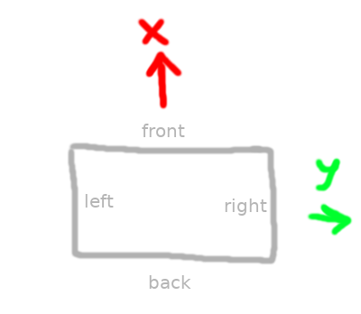
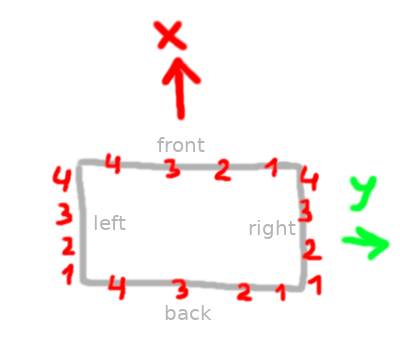

This document describes project scope, implementation details, and panel building examples and analysis.

## Project scope

The scope of the project is to provide a designer-friendly procedural generator for soviet era style panel buildings. To avoid over-complicating, the scope is **not** to provide the procedural generator for arbitrary panel house types.

## A grammar to describe panel building layouts

The goal is to come up with a grammar that would describe the layout of the panel building. Let's visualize a panel building like follows (when viewed from above):

Then one possible option is this:

`{front-rule}|{right-rule}|{back-rule}|{left-rule}`

- `|` is the side-separator, or the building corner
- each rule would look something like this: `1-2-0-{2-1-2-2-1-2-0}*-2-1`
  - each index represents a panel type (balcony, window, stairwell, etc.)
  - separating with hyphens makes indices > 9 possible
  - `|` means building corner
  - `{` creates a group (like in regular expressions)
  - `*` means zero or more (like in regular expressions)
  - `+` means one or more (like in regular expressions)

### Incomplete rules

A rule can be incomplete, for example:

`{front-rule}`

In this case the rule will be completed as follows:

- `{front-rule}` gets completed as `{front-rule}|{front-rule}|{front-rule}|{front-rule}`
- `{front-rule}|{right-rule}` gets completed as `{front-rule}|{right-rule}|{front-rule}|{right-rule}`
- `{front-rule}|{right-rule}|{back-rule}` gets completed as `{front-rule}|{right-rule}|{back-rule}|{right-rule}`

### Application order

It does not matter much for symmetric grammars like this one:

`3-2-2-3`

but for asymmetric ones like this:

`1-2-3-4`

the order of application must be known. The panels are generated from *right to left* and from *back to front* meaning that for this grammar the panels will be generated like this:

The convention is chosen to match the direction a reader would read a text (if viewing the house's front side from the negative x direction)

### Binding indices to panel types

Since the grammar is not aware of the actual panel types, the indices must be bound to actual panel types, where panel types might be enums or objects, similar to the `UDamageType`.

### Grammar as an asset

Grammars should be treated as assets (at least, a `UDataAsset`). Then, grammars don't need to be copied or retyped, and can be instead conveniently referenced from multiple actors in the level.

## Examples of panel buildings

Let's first denote:

- stairwell = 0
- balcony = 1
- window with two parts = 2
- window with three parts = 3
- long concrete panel = 4
- balcony type 2 = 5

The buildings in the examples to follow will be described with this mapping in mind.

### 1. Khrushchevka (example 1)

In this example, frontal side is most probably the same as the back side of the house, and the left and right side are presumably same, too. Between the consecutive stairwells, we can observe 6 windows, which represents two apartments of three rooms, each having one room with a balcony. Using the grammar syntax we defined above, this building layout can be described as follows:

`1-2-0-{2-1-2-2-1-2-0}*-2-1|4-2-2-4`

### 2. Khrushchevka (example 2)

Presumably, front and back sides and the left and right sides are the same here, too. It seems that the apartments at the corner only have two rooms, while the apartments between the consecutive stairwells have three rooms, and one of the rooms has a balcony. Then, it would seem that the grammar should be:

`1-2-0-{2-1-2-2-1-2-0}*-2-1|4-4`

### 3. II-29 Series

The building also look symmetric left-to-right and front-to-back. For the second-from-the-right building:

`2-2-0-{1-2-2-1-2-0}*-2-2|5-5`

This one is interesting in the respect that it has two balconies from the left and from the right.

